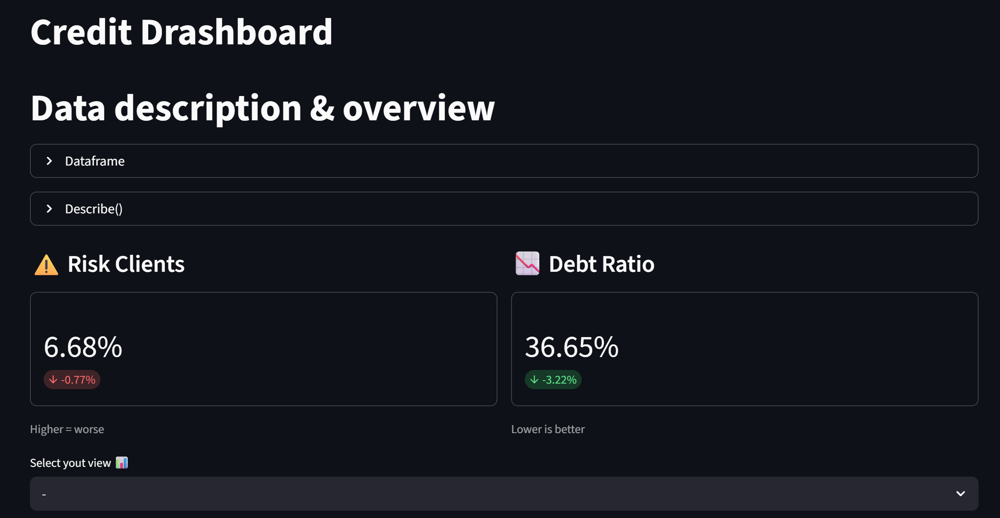

# Credit Risk Dashboard

An interactive dashboard for credit risk analysis and real-time client risk prediction, built with Python, Scikit-learn and Streamlit.

## Project Overview

This project uses the **Give Me Some Credit** dataset from Kaggle (150,000 clients) to build a machine learning model capable of identifying clients at risk of serious financial delinquency. The result is a fully interactive dashboard that combines data exploration, model metrics, and live predictions.

## Demo
https://credit-risk-drashboard-crboor6qufv2ptqzp4fwct.streamlit.app/


## Features

- **Data Overview** — Interactive dataframe and descriptive statistics
- **Key Metrics** — Risk client percentage and debt ratio at a glance
- **Visual Analysis** — Risk distribution, delayed payment analysis, and risk by age group
- **Model Metrics** — Precision, Recall and F1 Score displayed directly in the dashboard
- **Live Predictions** — Input a client's financial data and get an instant risk assessment from the trained model

## Tech Stack

- Python 3.11
- Pandas — data manipulation and cleaning
- Scikit-learn — model training and evaluation
- Streamlit — interactive dashboard
- Plotly — data visualizations
- Joblib — model persistence

## Project Structure

```
credit-risk-dashboard/
│
├── data.csv                  # Original dataset (cs-training.csv from Kaggle)
├── clean_data.csv            # Cleaned dataset after preprocessing
├── eda.py                    # Exploratory data analysis and data cleaning
├── model.py                  # Model training, evaluation and export
├── app.py                    # Streamlit dashboard
├── model.pkl                 # Trained Logistic Regression model
└── metrics_simple.pkl        # Saved model metrics (precision, recall, F1)
```

## Setup & Installation

**1. Clone the repository**
```bash
git clone https://github.com/RubenMC-44/credit-risk-dashboard.git
cd credit-risk-dashboard
```

**2. Create and activate conda environment**
```bash
conda create -n credit-risk python=3.11
conda activate credit-risk
```

**3. Install dependencies**
```bash
pip install pandas scikit-learn streamlit plotly joblib
```

**4. Download the dataset**

Download the [Give Me Some Credit](https://www.kaggle.com/competitions/GiveMeSomeCredit) dataset from Kaggle and place `cs-training.csv` in the project folder, renaming it to `data.csv`.

**5. Run data cleaning and model training**
The data files and model are not included in the repository.
Run these scripts to generate them locally before launching the app:
```bash
python eda.py
python model.py
```

**6. Launch the dashboard**
```bash
streamlit run app.py
```

## Methodology

### Data Cleaning

The dataset presented two columns with missing values:

- `MonthlyIncome` (~20% nulls) — filled with the **median**, since the mean was heavily skewed by extreme outliers (max value: ~$3M/month)
- `NumberOfDependents` (~2.6% nulls) — filled with the **mean**, since the median was 0 and not representative

### Class Imbalance

Only 6.68% of clients in the dataset are flagged as high risk. This creates a heavily imbalanced classification problem — a naive model that always predicts "no risk" would achieve 93% accuracy while being completely useless in practice.

To address this, `class_weight='balanced'` was used during model training, which penalises misclassification of the minority class more heavily.

### Model Selection

Two models were trained and compared:

| Model | Precision (class 1) | Recall (class 1) |
|-------|-------------------|-----------------|
| Logistic Regression | 0.27 | 0.57 |
| Random Forest | 0.54 | 0.16 |

**Logistic Regression was selected** because in a credit risk context, **recall is the priority metric**. Missing a high-risk client (false negative) is far more costly than flagging a low-risk client for manual review (false positive). Random Forest offered better precision but its recall of 0.16 meant it was missing 84% of actual risk cases — unacceptable for this use case.

## Dataset

- **Source:** [Give Me Some Credit — Kaggle](https://www.kaggle.com/competitions/GiveMeSomeCredit)
- **Size:** 150,000 rows, 11 features
- **Target variable:** `SeriousDlqin2yrs` — whether a client experienced 90+ days of financial distress in the past 2 years

## Author

Ruben Morcillo — [ruben.bonete@gmail.com](mailto:ruben.bonete@gmail.com)